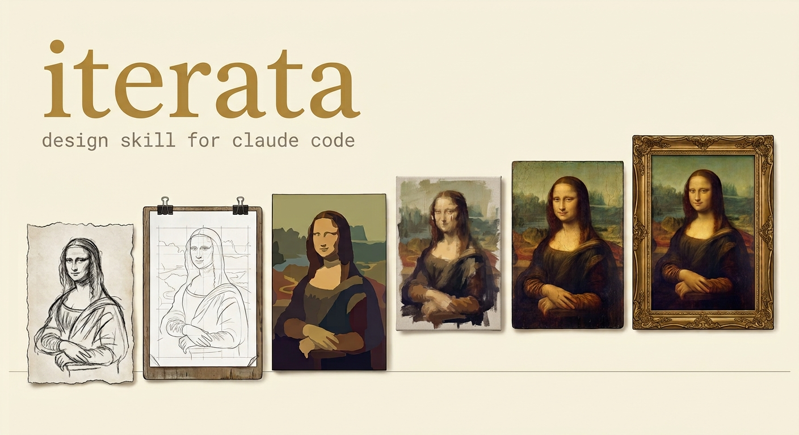

<p align="center">
  
</p>

<p align="center"><em>A two-speed design iteration loop for Claude Code.</em></p>

Most agent-driven design loops fail the same way: they are too slow to stay in
a conversation. You ask for a change, the agent spawns reviewers, runs a build,
captures a gallery, and comes back twenty five minutes later with a version you
did not want. By then you have lost the thread.

This tool splits the loop in two.

**Micro-iteration** is the default and runs in seconds. One change, one
screenshot against the already-running dev server, shown to you immediately.
Your reaction is the feedback loop. No subagents, no build, no ceremony.

**Checkpoint** runs on request. It builds, serves, captures the full set across
viewports and themes, optionally runs a design critique and an adversarial pass
over that critique, and tags a version you can revert to.

## Install

```bash
npm install
npx playwright install chromium
```

Then, in the project you are designing, copy `config.example.json` to
`iterata.config.json` and set `hideOnFullPage` and `sections`. Every
field has a default, so the tool also runs with no config against a plain
Next.js app.

Install the skill by copying `skill/SKILL.md` to
`.claude/skills/iterata/SKILL.md` in the consuming project.

## Use

```bash
# Micro-iteration: one shot against a running dev server, seconds.
iterata hero-spacing --quick

# Against something other than localhost:3000
iterata hero-spacing --quick --url http://localhost:5173

# Checkpoint: build, serve, capture the whole set.
iterata v0.4

# Checkpoint without rebuilding
iterata v0.4 --skip-build
```

Output lands in `design-lab/quick/<label>.jpg` or
`design-lab/<version>/screens/*.jpg`.

## What the full rig captures

| Shot | Why |
|---|---|
| `desktop-dark-full` | Whole-page composition and rhythm |
| `desktop-dark-hero` | First viewport, with fixed chrome left in |
| `desktop-dark-<section>` | One crop per configured section id |
| `mobile-dark-full` | Narrow-viewport layout |
| `desktop-light-full` | The other theme |
| `desktop-dark-reduced-motion` | Content must land in its final state |

Fixed elements are hidden during full-page captures, because a
`position: fixed` header repeats down the image otherwise. Theme is seeded
into `localStorage` before load so shots are deterministic rather than
depending on the OS setting.

## Status

Version 0.1.0, extracted from the project it was built for. It has real
mileage (seven tagged design versions on a production site) and real gaps.

**Read [REPORT.md](REPORT.md) before building on it.** It documents what
works, what broke in practice, and the seven things that are missing, in
priority order. The largest by a distance: a screenshot cannot review an
animation, and this tool captures screenshots.

## License

MIT.
